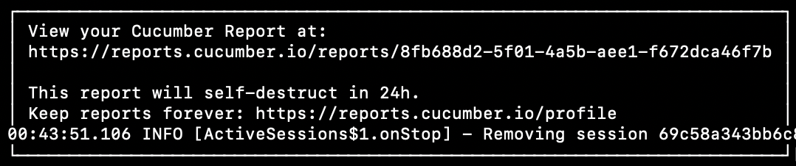
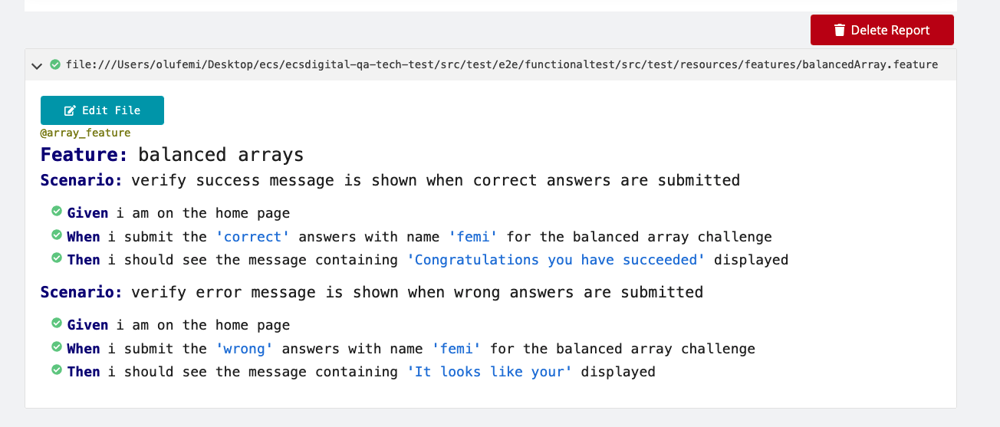

# ECSD Tech Test
Welcome to the ECSD Tech Test 

Please make a clone of this repository

## Running the application

## To Run Test 

You will need to have [docker] installed and running to build the image.

Ports to be available:
- 3000:3000
- 5900:5900
- 4444:4444
 
Please run the shell script [functionaltest] in this directory (the one containing README.md!)

- On Mac `sh functionaltest.sh`
- On Linux  `bash functionaltest.sh`

This will start the app, run the tests and tear down the test and app (All running Containers)

* View test run by using the VNC server. In your browser type in vnc://localhost:5900
When you are prompted for the password it is **secret**

Please note that you may or may not face some issues with the host machine IP address
I have currently set this to use the default IP addresses of container networks `172.17.0.1`
It may be possible that you have this IP already in use, therefore you can edit the IP in the docker compose found in the  `/src/test/e2e/docker-compose.yml` file 

* Edit the following host IPs in the following fields
    >  -Dbrowser.remote_uri
    
    >  *-Dtest.url.* 
    
    - On Mac OS replace host ip address with host.docker.internal- Example `http://host.docker.internal:3000`
    - On Linux OS Get your host machine IP address. For example using 
    *ifconfig* on your terminal and search for IPv4 address or inet addr. 
  

## Test Report

On CI you should see the following link after test run to view the report

Click on the link and you should be able to view the report

## Implementation

Test was written in Java

[BDD balancedArray.feature] was used to test both positive and negative testcase

[Unit test] was written in the form of TDD to test the function/class implementing the `sum of integers at the left equal to the sum of integers at the right` and other classes

App source code was also edited to add some data-test-id's

[functionaltest] is the shell script to spin up and down the app and test.

Docker Compose is used to ensure simplicity for the CI.

Test can also be run manually via the [testNG xml] file

## Issues or bugs

Success message on the test, stays persistent once you pass the test. Any further run on the test with bad input still give the success message 

[BDD balancedArray.feature]: src/test/e2e/functionaltest/src/test/resources/features/balancedArray.feature
[functionaltest]: functionaltest.sh
[Unit test]: src/test/e2e/core/src/test/java/com/ecsd/automation/brand/CalculationsTest.java
[testNG xml]: src/test/e2e/functionaltest/src/test/resources/default-suite.xml

[docker]: https://docs.docker.com/get-started/

